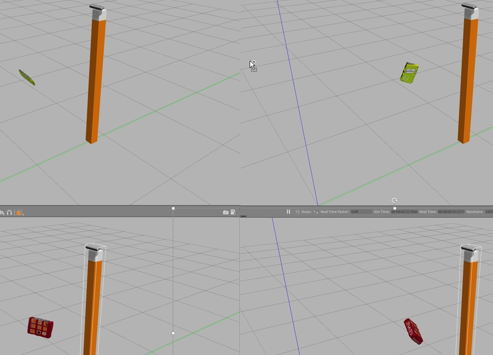
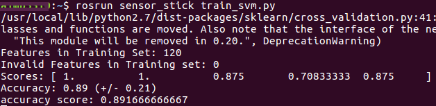
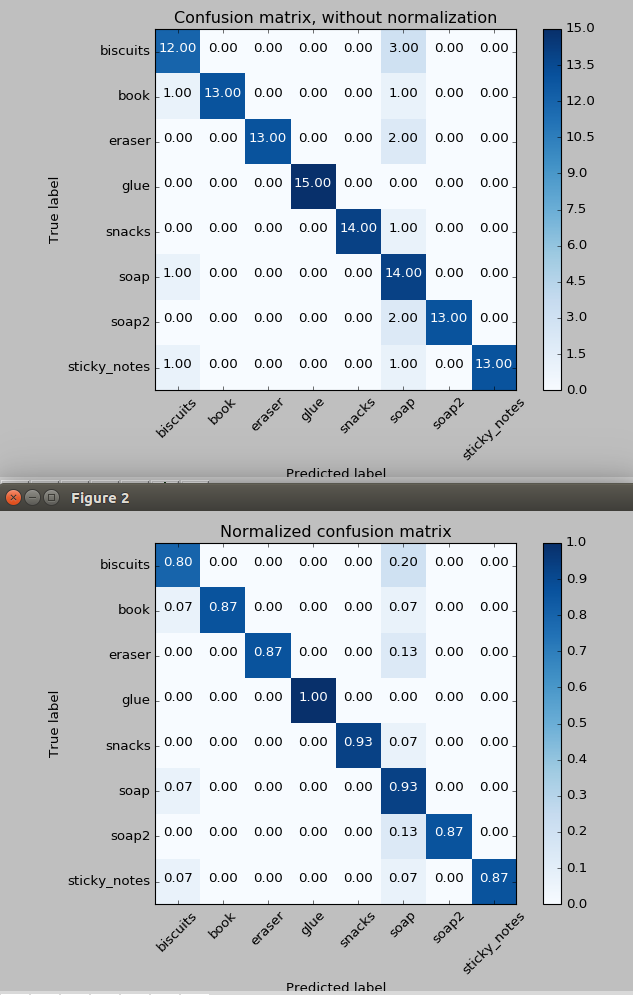
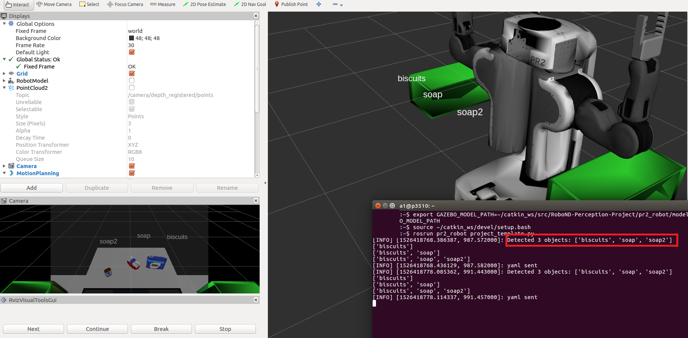
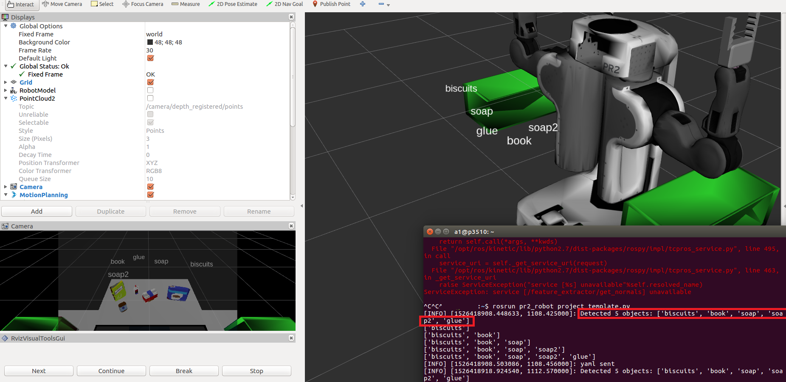
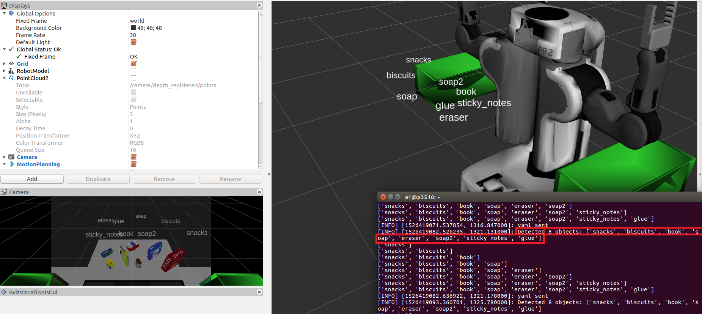
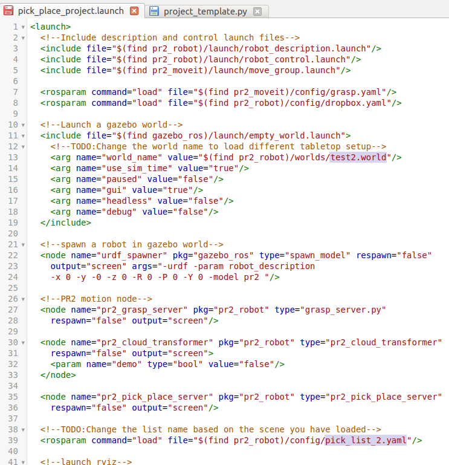
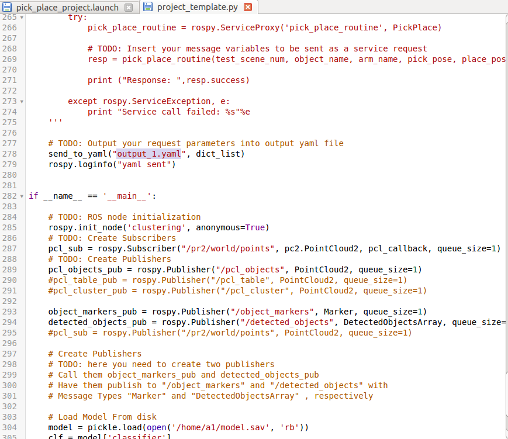

[UDACITY RoboND-Perception-Project](https://github.com/udacity/RoboND-Perception-Project)


[Exercise #1 - Tabletop Segmentation](https://github.com/caudaz/robotND1-proj3/blob/master/class_code/L17-Exercise-1/README.md)


[Exercise #2 - Euclidean Clustering with ROS and PCL](https://github.com/caudaz/robotND1-proj3/blob/master/class_code/L17_Exercise-2/README.md)


[Exercise #3 - Object Recognition with Python, ROS and PCL](https://github.com/caudaz/robotND1-proj3/blob/master/class_code/L17_Exercise-3/README.md)


# **Robotics Nanodegree** #

# **Term1 – Project3: 3D Perception** #


## **INITIAL SETUP** ##

```diff
- NOTE: THIS MODEL ONLY WORKS WITH UBUNTU16.04 AND ROS1-KINETIC
(TESTED ON UBUNTU18.04 AND ROS1-MELODIC AND DID NOT WORK!!!)
```

```
mkdir -p ~/catkin_ws/src
cd ~/catkin_ws/
catkin_make
cd ~/catkin_ws/src
git clone https://github.com/caudaz/RoboND-Perception-Project
cd ~/catkin_ws
rosdep install --from-paths src --ignore-src --rosdistro=kinetic -y
cd ~/catkin_ws
catkin_make
```

```
------------- Errors in files: pr2_motion.cpp AND pr2_pick_place_server.cpp -----------------
Fix: cast variable using static_cast
bool right_success = right_move_group.move();
bool right_success = static_cast<bool>(right_move_group.move());
------------------------------
```

DEMO
```
export GAZEBO_MODEL_PATH=~/catkin_ws/src/RoboND-Perception-Project/pr2_robot/models:$GAZEBO_MODEL_PATH
source ~/catkin_ws/devel/setup.bash
cd ~/catkin_ws/src/RoboND-Perception-Project/pr2_robot/scripts
chmod u+x pr2_safe_spawner.sh
./pr2_safe_spawner.sh
```


## **1 - CAPTURE FEATURES** ##

Terminal#1
```
export GAZEBO_MODEL_PATH=~/catkin_ws/src/RoboND-Perception-Project/sensor_stick/models
source ~/catkin_ws/devel/setup.bash
roslaunch sensor_stick training.launch 
```

Terminal#2
```
source ~/catkin_ws/devel/setup.bash
rosrun sensor_stick capture_features.py 
```




## **2 - SVM TRAINING** ##

Terminal#1
```
export GAZEBO_MODEL_PATH=~/catkin_ws/src/RoboND-Perception-Project/sensor_stick/models
source ~/catkin_ws/devel/setup.bash
rosrun sensor_stick train_svm.py
```





In train_svm.py it was necessary to use a LinearSVC classifier with a C value of 0.01 to improve the accuracy of the predictions compared to Exercise#2 and #3
```
clf = LinearSVC(C=0.01, 
                class_weight=None, 
                dual=True, 
                fit_intercept=True,
                intercept_scaling=1, 
                loss='hinge', 
                max_iter=2000,
                multi_class='ovr', 
                penalty='l2', 
                random_state=0, 
                tol=0.0002,
                verbose=0)
```


## **3 - 3D PERCEPTION** ##

Terminal#1
```
export GAZEBO_MODEL_PATH=~/catkin_ws/src/RoboND-Perception-Project/pr2_robot/models:$GAZEBO_MODEL_PATH
source ~/catkin_ws/devel/setup.bash
roslaunch pr2_robot pick_place_project.launch
```

Terminal#2
```
export GAZEBO_MODEL_PATH=~/catkin_ws/src/RoboND-Perception-Project/pr2_robot/models:$GAZEBO_MODEL_PATH
source ~/catkin_ws/devel/setup.bash
rosrun pr2_robot project_template.py
```

World#1



World#2



World#3


It was necessary to use a statistical filter to deal with the point cloud noise on project_template.py
```
filter = cloud.make_statistical_outlier_filter()
```
It was also necessary to add a second passthrough filter in the x-dir (besides the z-dir)
```
passthrough_x = cloud_filtered.make_passthrough_filter()
filter_axis = 'x'
```


## **OUTPUT FILES** ##

[Features](./output_files/training_set.sav)


[SVC model](./output_files/model.sav)


[World1 Yaml](./output_files/output_1.yaml)


[World2 Yaml](./output_files/output_2.yaml)


[World3 Yaml](./output_files/output_3.yaml)


## **INSTRUCTIONS TO SWITCH BETWEEN FILES** ##




