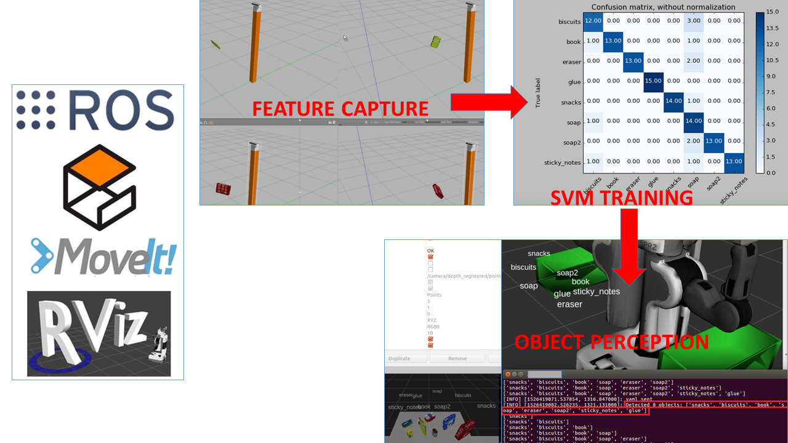

[UDACITY RoboND-Perception-Project](https://github.com/udacity/RoboND-Perception-Project)


[Exercise #1 - Tabletop Segmentation](https://github.com/caudaz/robotND1-proj3/blob/master/class_code/L17-Exercise-1/README.md)


[Exercise #2 - Euclidean Clustering with ROS and PCL](https://github.com/caudaz/robotND1-proj3/blob/master/class_code/L17_Exercise-2/README.md)


[Exercise #3 - Object Recognition with Python, ROS and PCL](https://github.com/caudaz/robotND1-proj3/blob/master/class_code/L17_Exercise-3/README.md)


# **Robotics Nanodegree** #

# **Term1 – Project3: 3D Perception** #




## **INITIAL SETUP** ##

```
mkdir -p ~/catkin_ws/src
cd ~/catkin_ws/
catkin_make
cd ~/catkin_ws/src
git clone https://github.com/caudaz/RoboND-Perception-Project
cd ~/catkin_ws
rosdep install --from-paths src --ignore-src --rosdistro=kinetic -y
cd ~/catkin_ws
catkin_make
```

------------- Errors in files: pr2_motion.cpp AND pr2_pick_place_server.cpp -----------------
Fix: cast variable using static_cast
bool right_success = right_move_group.move();
bool right_success = static_cast<bool>(right_move_group.move());
------------------------------

DEMO
```
export GAZEBO_MODEL_PATH=~/catkin_ws/src/RoboND-Perception-Project/pr2_robot/models:$GAZEBO_MODEL_PATH
source ~/catkin_ws/devel/setup.bash
cd ~/catkin_ws/src/RoboND-Perception-Project/pr2_robot/scripts
chmod u+x pr2_safe_spawner.sh
./pr2_safe_spawner.sh
```

